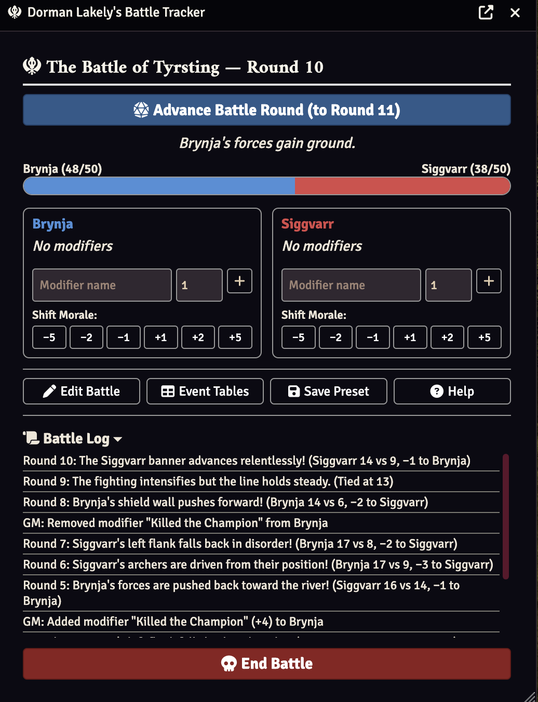
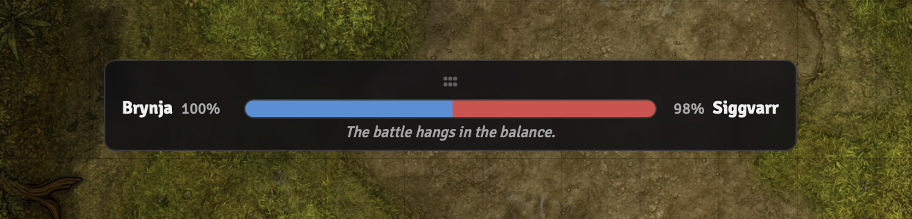

# Dorman Lakely's Battle Tracker

A FoundryVTT module for running large-scale wars and battles alongside normal D&D encounters. Track the ebb and flow of massive conflicts using dual morale HP pools, opposed dice rolls, narrative events, and a player-facing tug-of-war HUD — all while your PCs fight their own encounters on the battlemap.

## How It Works

While PCs engage enemies in normal combat, the war rages around them. Each faction has a **morale HP pool** representing their army's fighting spirit. As the battle progresses, the GM advances rounds — opposed dice rolls determine which side takes morale damage, and narrative events describe what's happening on the battlefield.

When a faction's morale reaches 0, that army is defeated.

## Features

- **Dual Faction Morale Pools** — Each side has configurable max HP representing their army's strength
- **Advance Battle Round** — Opposed dice rolls with Foundry's Roll system (dice sounds, animations, and dice log)
- **Configurable Dice** — Choose from 1d20, 3d6, 2d10, 1d12, 4d6, or other formulas per battle
- **Named Roll Modifiers** — Give a faction temporary bonuses or penalties (e.g. "Killed the Champion" +4)
- **GM Morale Shift Buttons** — Manually adjust morale in increments of 1, 2, or 5
- **Narrative Event Tables** — Customizable flavor text for wins, losses, and stalemates
- **Threshold Events** — Special narrative moments at 75%, 50%, and 25% morale with editable text
- **Victory Detection** — Dramatic chat card when a faction reaches 0 HP
- **Player Tug-of-War HUD** — A draggable bar showing relative faction strength (hidden from the primary GM)
- **Battle Presets** — Save, load, and delete battle configurations for reuse
- **Edit Mid-Battle** — Change faction names, colors, dice formula, and damage range during a battle
- **Multi-Client Sync** — All changes sync across connected clients via socket events
- **XSS Prevention** — All user-controlled text is escaped before rendering

## Getting Started

1. **Install the module** via Foundry's module manager or by pasting the manifest URL
2. **Enable the module** in your world's module settings
3. **Click the crossed swords icon** (⚔) in the Token Controls toolbar (GM only)
4. **Configure your battle** — name it, set faction names/colors, choose max HP and dice formula
5. **Start the battle** — players will see the tug-of-war HUD appear on screen

## Running a Battle

1. **Advance Battle Round** — Click the blue button to roll opposed dice for both factions. The loser takes morale damage, and a narrative event describes what happened.
2. **Add Modifiers** — Give a faction a named bonus or penalty that applies to their rolls (e.g. the PCs rescued a general: +3 to their faction).
3. **Shift Morale** — Use the +/- buttons to manually adjust morale when narrative events warrant it.
4. **Edit Event Tables** — Customize the flavor text and threshold messages to match your battle's story.
5. **End Battle** — When the story is done, click End Battle to clean up.

## Tips

- **Roll when it makes narrative sense** — There's no auto-roll tied to combat rounds. Advance the battle round when dramatic moments call for it.
- **Use modifiers to reflect PC actions** — If the party defeats an enemy commander, add a modifier to their faction. Remove it when the effect wears off.
- **Customize event tables per battle** — Generic fantasy text is provided, but your battle will feel much better with custom descriptions.
- **Save presets** — If you run recurring battles or want templates, save your configuration as a preset.

## Compatibility

- **Foundry VTT:** v13+
- **System:** System-agnostic (works with any game system)

## License

MIT License — see [LICENSE](LICENSE) for details.
